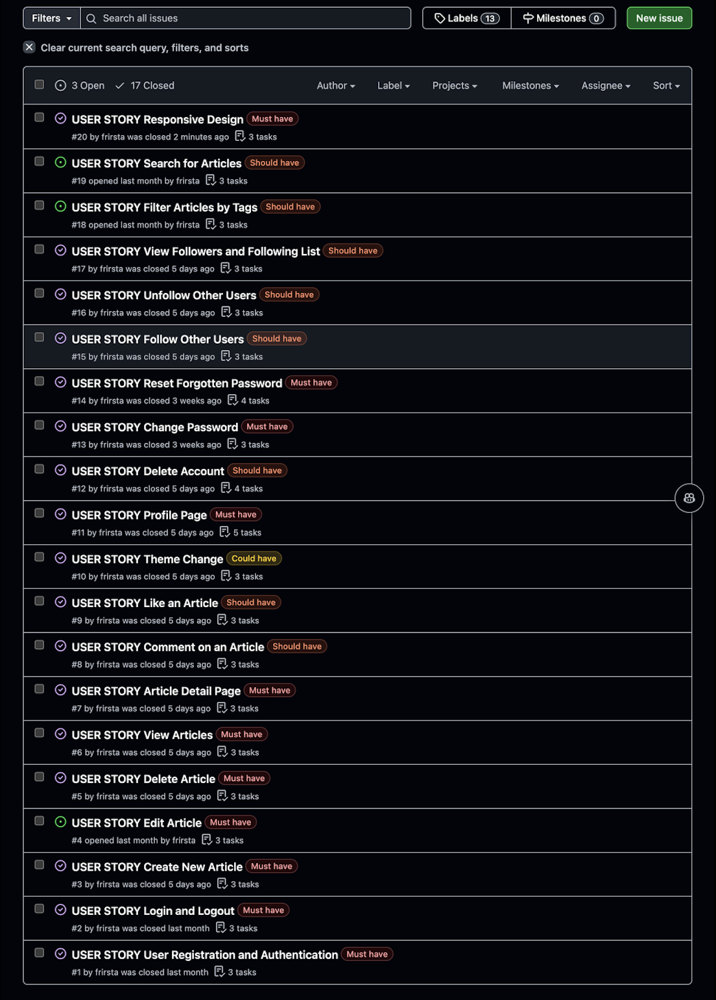

# The Blog / Blogify

Blogify is a full-featured, responsive blog platform designed to facilitate meaningful content sharing and interaction among users. With a focus on community, Blogify enables users to connect by following each other, liking posts, commenting, and exploring content across various categories and tags. Built with Next.js, the platform provides a seamless, fast-loading frontend experience, while leveraging robust authentication and an efficient REST API to connect with the Django backend.

Live link: [Live](https://frirsta-blog-frontend-bfdde69332c7.herokuapp.com/)

Frontend repository: [Repository](https://github.com/frirsta/blog_frontend)

Backend repository: [Repository](https://github.com/frirsta/blog_backend)

- [Project](#the-blog--blogify)
- [Project management](#project-management)
- [User Experience UX](#user-experience-ux)
- [Features](#features)
- [Future Features](#future-features)
- [Testing](#testing)
- [Technologies](#technologies)
- [Bugs](#bugs)
- [Deployment](#deployment)
- [Credits](#credits)

# Responsive Mockup

# Project Management

I have used Github issues and Github project board for project management.

### Agile methodology

- **Must Have** - Are the issues that have to be top priority.
- **Should have** - Are second priority.
- **Could have** - Third priority.
- **Won't have** - Will not be in the project.

# User Experience UX

# Features

## Existing Features

### Navigation bar

#### Bottom Navigation (BtmNav.js)

The Bottom Navigation is a mobile-responsive component that gives users quick access to essential features. It appears as a fixed bar at the bottom of the screen when users are logged in.

- Home Button: Directs users to the main posts page.
- Add Post Button: Opens the CreatePost modal for users to create a new post.
- Profile and Settings: Accessible through the user avatar, with options to visit the profile, go to settings, and log out.

#### Sidebar Navigation (Drawer.js)

For larger screens, the Sidebar Navigation appears as a fixed, vertical menu on the left side of the page, enhancing the desktop experience.

- Icons: Displays navigation icons for home, adding a post, and settings.
- Profile and Options Dropdown: The user avatar opens a dropdown with links to the profile page, settings, and a logout option.
- Modal Support: Clicking the add button (IoIosAddCircle) opens the CreatePost modal for easy post creation.

These navigation components ensure a consistent, responsive user experience across both mobile and desktop views.

### User Authentication

- Sign up, log in, and password reset functionality is available with case-insensitive username handling, ensuring an accessible, user-friendly experience.
- AuthContext ensures token management and automatic refresh for seamless session handling.

### Image Upload, Editor, and Blog Post Uploader

Blogify provides an intuitive process for creating new posts, including image upload, editing, and a rich text editor for content creation. These steps ensure users can easily share visually appealing and well-crafted blog posts.

1. Image Upload and Editor
   The image upload feature allows users to attach an image to their post, enhancing visual storytelling. After selecting an image, users are taken to an integrated image editor where they can fine-tune the uploaded image before adding it to their post.

- Upload Interface: A file input area allows users to upload their image.
  

- Preview: After editing, users see a preview of the image before proceeding with the post.
  

2. Post Content Editor
   Once the image is uploaded and edited, users can begin crafting their post. The post editor supports rich text formatting, making it easy to create visually appealing content.

- Title Input: Users can add a title for the post.
- Text Editor: A rich text editor (Jodit Editor) allows for text formatting.
- Category Selection: Users can select a category for their post from a predefined list of options such as Health, Beauty, Travel, City, etc.
- Tags: Users can add tags to categorize their post further and improve discoverability.

  

3. Saving and Publishing
   Once the post is complete, users can publish it immediately. The post, along with the uploaded image and content, is sent to the backend via a multipart/form-data request. The backend handles storing the image and post content.

- User Feedback: Users are informed with clear success or error messages during the post upload process.

- Sanitization: The content entered by the user is sanitized to prevent security risks, ensuring that malicious scripts do not get executed when the post is viewed.

### Warnings and Discarding Edits

If the user tries to navigate away from the post editor or backtrack without saving, a warning modal appears, confirming whether the user wants to discard their unsaved changes. This ensures that users don't lose any progress accidentally.

### Posts Page

- Posts Feed: Displays a feed of all posts by users, allowing for seamless content exploration.

  

  

- **Like Functionality**: Users can like posts, with a dynamic like count that updates in real-time.

   

### Explore Accounts

- This feature displays a list of suggested users that the current user is not already following, allowing for easier discovery of new accounts.

  

### User Search

- Allowing users to search for other users by their username.
  

### Post Details

 

- **Comments**: Users can comment on posts, contributing to interactive discussions.
  

   

### Profile Page

#### **User Information Display**:

##### **Users can personalize their profile with**:

- **Profile Picture and Cover Image**: Upload and update profile and cover images to give a personalized touch.
- **Bio**: Write a short introduction or description about themselves.
- **Website and Location**: Include optional information such as a personal website and location.

   

##### **Profile Statistics**:

- **Followers and Following Lists**: Users can view lists of their followers and the people they are following.
- **Posts Count**: Displays the total number of posts created by the user.

   
   

##### **Profile Actions**:

- **Follow/Unfollow Button**: Users can follow or unfollow other profiles directly from the profile page.
  

- **Menu**: The menu allows the profile owner to go to the edit profile page, settings page or log out of the application.

  

## Future Features

- **Notifications**: Real-time notifications for likes, follows, and comments to keep users updated.
- **Analytics Dashboard**: Insightful analytics for users to track their post engagement and follower growth.

# Testing

## Loghthouse

### Sign in

### Sign up

# Technologies

## Core technologies

- Next.js: A React framework used for building the frontend (next version 15.0.3).
- React: A JavaScript library for building user interfaces (react and react-dom version 18).
- Tailwind CSS: A utility-first CSS framework used for styling (tailwindcss version 3.4.1).

## UI and Design

- daisyUI: A Tailwind CSS plugin that provides pre-designed components (daisyui version 4.12.13).
- @pqina/pintura: An image editor for the frontend (@pqina/pintura version 8.89.2).
- framer-motion: A library for animations and transitions in React (framer-motion version 11.11.6).
- hamburger-react: A React component for creating a hamburger menu (hamburger-react version 2.5.1).
- react-icons: A library for including icons in React (react-icons version 5.3.0).
- react-select: A flexible and customizable dropdown component (react-select version 5.8.2).
- theme-change: A library for theme switching (theme-change version 2.5.0).

## Utilities

- axios: A promise-based HTTP client for making API requests (axios version 1.7.7).
- date-fns: A library for working with dates (date-fns version 4.1.0).
- jwt-decode: A library for decoding JWT tokens (jwt-decode version 4.0.0).
- dompurify: A library for sanitizing HTML (dompurify version 3.1.7).
- country-list: A library for working with country lists (country-list version 2.3.0).

# Bugs

- Occasionally, the dropdown menu in the navigation bar may not close on mobile when switching between pages. This issue is actively being worked on and will be resolved in future updates.

# Deployment

## Deploying to Heroku

This project is deployed to Heroku. To deploy it, follow these steps:

1. Create a new app on the [Heroku Dashboard](https://heroku.com/).

2. Connect the app to the frontend GitHub repository.

3. Deploy the app.

## Live Link

Live link [Live](https://frirsta-blog-frontend-bfdde69332c7.herokuapp.com/)

# Credits

## Media

### Icons

- React icons
